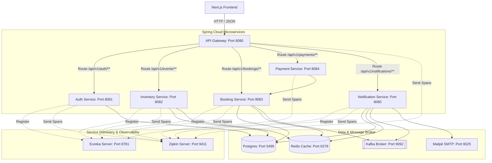
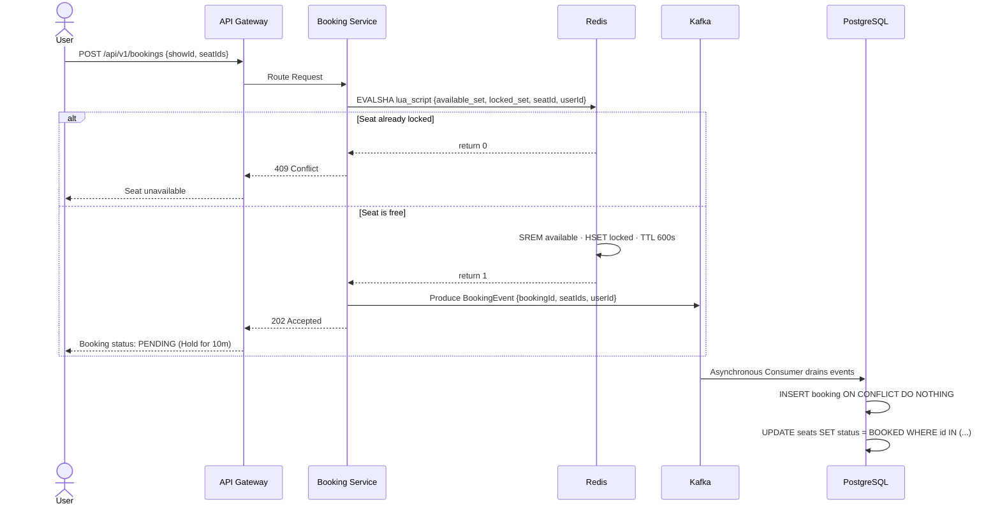

<div align="center">

<h1>Ticketizer</h1>

<p><em>High-concurrency distributed ticket booking engine built on a Spring Cloud microservices architecture — engineered to handle massive flash-sale traffic without overselling a single seat.</em></p>
 
[](https://openjdk.org/projects/jdk/21/)
[](https://spring.io/projects/spring-boot)
[](https://spring.io/projects/spring-cloud)
[](https://nextjs.org)
[](https://www.postgresql.org)
[](https://redis.io)
[](https://kafka.apache.org)
[](https://www.docker.com)
[](LICENSE)

**[Live Demo](https://ticketizer-five.vercel.app)** · **[Report Bug](https://github.com/ShvetGhareWork/Ticketizer/issues)** · **[Request Feature](https://github.com/ShvetGhareWork/Ticketizer/issues)**

</div>

[](https://youtu.be/4TIaE3U9K-Q)

---

## The Problem

Most ticket booking systems collapse during high-demand sales (e.g., concert tickets or popular movie releases). High concurrent traffic trying to reserve the exact same seats leads to:

- **Database deadlocks** due to concurrent `SELECT FOR UPDATE` queries locking identical seat rows.
- **Overselling** because multiple parallel transactions read "seat available" simultaneously and both commit.
- **Cascade failures** as database connection pools exhaust under spike traffic, bringing down unrelated services.

Ticketizer resolves this by shifting the reservation bottleneck from the database to an **in-memory Redis cache**—where atomic Lua scripts perform seat lock verification as a single-threaded, sub-10ms operation—and draining writes asynchronously using **Apache Kafka** event streams.

---

## Architecture Overview

Ticketizer is designed using a decoupled **Spring Cloud Microservices Architecture**:



### Microservices Directory

1. **API Gateway (Spring Cloud Gateway)**: Exposes a single public ingress (`8080`), handles global CORS, and routes traffic dynamically to backend microservices.
2. **Eureka Server**: A service registry allowing microservices to discover and communicate with each other dynamically.
3. **Auth Service**: Manages JWT authentication, Google OAuth integrations, user accounts, OTP generation, and email verification.
4. **Inventory Service**: Manages events, shows, and seat layouts. Responsible for warming up Redis caches with available seats prior to ticket sales.
5. **Booking Service**: Manages seat locks and reservation states. Locks seats atomically using Lua scripts in Redis and emits booking events to Kafka.
6. **Payment Service**: Handles Razorpay gateway integration and captures webhook payments to transition bookings from `PENDING` to `CONFIRMED`.
7. **Notification Service**: Consumes Kafka event streams to send real-time ticket confirmation and registration verification emails via Mailpit SMTP.
8. **Ticketflow Common**: A shared core dependency containing shared DTOs, security filters, custom models, and utility classes.

---

## Request Lifecycle (Booking a Seat)



---

## Key Design Decisions

| Challenge                      | Naive Approach                           | Ticketizer's Approach                                                  |
| :----------------------------- | :--------------------------------------- | :--------------------------------------------------------------------- |
| **Concurrent Seat Requests**   | `SELECT FOR UPDATE` on Postgres seats    | Atomic Redis Lua script — single-threaded validation in memory.        |
| **Duplicate Message Delivery** | At-most-once delivery                    | Idempotent consumers + `INSERT ... ON CONFLICT DO NOTHING`.            |
| **Connection Pool Exhaustion** | Direct database writes on request thread | Kafka event consumers drain writes to PostgreSQL at a steady pace.     |
| **Expired Seat Holds**         | CRON polling job                         | Redis TTL + Keyspace Notifications (`notify-keyspace-events Ex`).      |
| **Payment vs. Expiry Race**    | Application-level checks                 | Optimistic Locking (`@Version`) on the DB Booking entities.            |
| **Poison-Pill Messages**       | Block Kafka partition                    | Dead Letter Queue (`ticket-reservations-dlq`) + Custom Error Handlers. |

---

## Tech Stack

- **Backend**: Java 21, Spring Boot 3.3, Spring Cloud (Gateway, Netflix Eureka, OpenFeign), Spring Data JPA, Hibernate, Spring Kafka (Idempotent Producer / Manual ACK Consumer), Redisson (Distributed Locks), Micrometer Tracing & OTEL.
- **Frontend**: Next.js 16 (App Router), React 19, TypeScript, Tailwind CSS, Framer Motion, Zustand, Lucide Icons.
- **Infrastructure**: PostgreSQL 16, Redis 7 (Keyspace events enabled), Apache Kafka 3.6 (Confluent Platform), Mailpit (Mock SMTP server), Zipkin (Distributed tracing engine), Docker & Docker Compose.

---

## Ports Mapping

| Service / Infrastructure    | Local Port | URL / Path                          |
| :-------------------------- | :--------- | :---------------------------------- |
| **API Gateway**             | `8080`     | `http://localhost:8080`             |
| **Eureka Discovery Server** | `8761`     | `http://localhost:8761`             |
| **Auth Service**            | `8081`     | `http://localhost:8081`             |
| **Inventory Service**       | `8082`     | `http://localhost:8082`             |
| **Booking Service**         | `8083`     | `http://localhost:8083`             |
| **Payment Service**         | `8084`     | `http://localhost:8084`             |
| **Notification Service**    | `8085`     | `http://localhost:8085`             |
| **Zipkin Distributed Trace** | `9411`    | `http://localhost:9411`             |
| **Mailpit Web UI**          | `8025`     | `http://localhost:8025`             |
| **PostgreSQL Database**     | `5499`     | `localhost:5499` (DB: `ticketflow`) |
| **Redis Cache**             | `6379`     | `localhost:6379`                    |
| **Kafka Broker**            | `9092`     | `localhost:9092`                    |
| **Next.js Frontend**        | `3000`     | `http://localhost:3000`             |

---

## Getting Started

### Prerequisites

- [Docker & Docker Compose](https://www.docker.com/)
- [Java 21 JDK](https://openjdk.org/projects/jdk/21/)
- [Node.js (v18+) & npm](https://nodejs.org/)

---

### Step 1: Build the Microservice JARs

Before running the containers, compile the shared common library and build the executable JAR files:

```bash
# Clean and compile parent Maven project with all modules
./mvnw clean package -DskipTests          # Linux/macOS
.\mvnw.cmd clean package -DskipTests      # Windows PowerShell
```

### Step 2: Spin Up Infrastructure and Microservices

Build and start all docker containers (PostgreSQL, Redis, Kafka, Mailpit, Eureka Server, Gateway, and services):

```bash
docker compose up --build -d
```

> [!NOTE]
> On first boot, Hibernate will automatically initialize the database schema in PostgreSQL. The system will seed test events and seats automatically. Check the health status of all containers before testing.

### Step 3: Run the Frontend

Go to the frontend directory, install dependencies, and run the development server:

```bash
cd frontend
npm install
npm run dev
```

Open `http://localhost:3000` in your web browser.

---

## Project Structure

```
Ticketizer/
├── src/
│   ├── api-gateway/            # Spring Cloud API Gateway (Routing & CORS)
│   ├── auth-service/           # JWT, User Registration, Google Sign-in & OTP
│   ├── booking-service/        # Seat allocation, Redis locks, Booking state
│   ├── eureka-server/          # Spring Cloud Eureka Service Registry
│   ├── inventory-service/      # Event management, Seat layout & Redis warm-up
│   ├── notification-service/   # Asynchronous Email alerts via Mailpit
│   ├── payment-service/        # Webhook integration with Razorpay
│   └── ticketflow-common/      # Shared domain entities, filters, exceptions & DTOs
│
├── frontend/                   # Next.js 16 Client (React 19, TS, Zustand)
│   ├── src/app/                # App Router Pages (Events, Seats, Checkout, My Bookings)
│   └── src/components/         # Reusable components (SeatGrid, TicketCard, Countdown)
│
├── docker-compose.yml          # Local infra & microservice definitions
└── pom.xml                     # Parent Maven configuration
```

---

## How Seat Expiry Works

When a user selects seats, they are given a **10-minute hold** to complete the payment:

1. **Redis Hold**: The seats are moved from available to locked in Redis cache via a Lua script, and a key `lock:seat:{seatId}` is created with a `600-second` TTL.
2. **Expired Event**: If the payment is not completed before the TTL expires, Redis fires a Keyspace Expiration event (`notify-keyspace-events Ex`).
3. **Database Reversion**: The `booking-service` catches the expiration event, checks if the booking is still `PENDING`, updates its status to `EXPIRED`, and releases the seat locks back to the available pool.

---

## Performance & Load Testing

We conducted high-concurrency performance validation using Apache JMeter targeting the public seating map endpoint (`GET /api/v1/reservations/show/1/seats`):

- **Concurrency Load**: Simulated multi-threaded concurrent user load.
- **Latency Performance**: Response times remained **consistently below 200ms**.
- **Observability**: Real-time trace propagation and service dependency metrics verified successfully on the Zipkin observability dashboard at `http://localhost:9411`.

---

## Contributing

Pull requests are welcome. For major changes, open an issue first.

```bash
git checkout -b feature/your-feature
git commit -m "feat: describe your change"
git push origin feature/your-feature
```

---

<div align="center">

Built by [Shvet Ghare](https://shvet.vercel.app)

</div>
