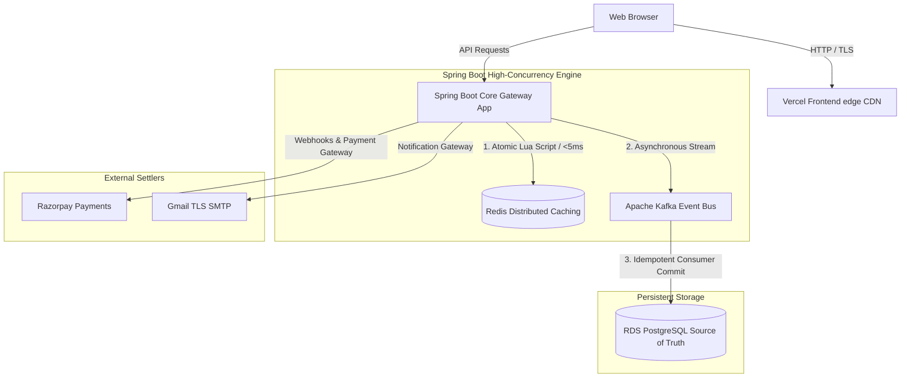
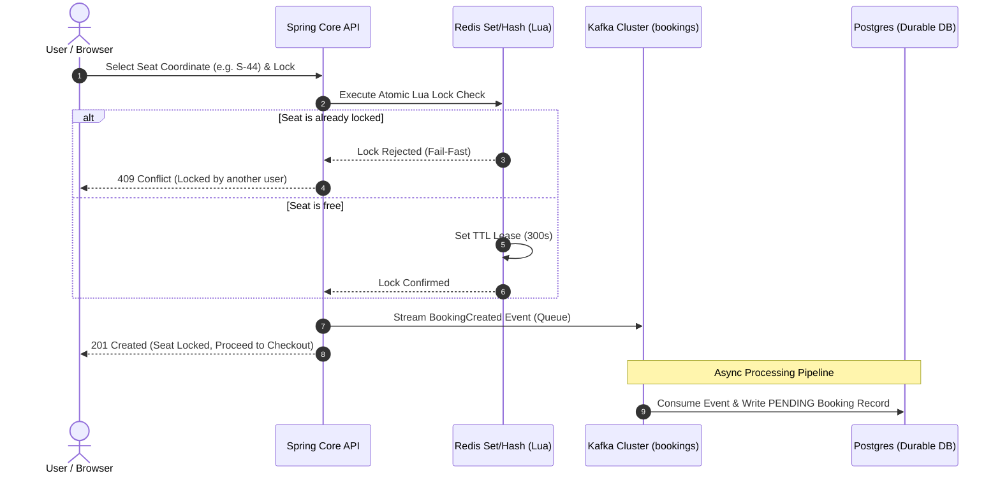

# 🎫 TICKETIZER // TRANSACTIONAL CONGESTION CORE GATEWAY

A production-grade, distributed ticket allocation engine engineered to handle extreme concurrency spikes (e.g., viral ticket drops) without data drift, inventory overselling, or database deadlocks.

The architecture decouples immediate, low-latency reservation state management from asynchronous relational storage convergence using a hybrid **memory/event-driven design**.

---

## 🚀 Architectural Architecture Overview



### ⚡ Transactional Flow Sequence (Seat Booking)



---

## ⚡ Core Technical Specifications

- **Atomic Fast-Path Inventory Locks**: Uses Redis Set/Hash operations managed via atomic **Lua Scripts** to validate and secure seat locks in `<10ms`, dropping excess surge traffic before it hits the relational database.
- **Asynchronous Ingestion Bus**: Leverages **Apache Kafka** to stream secured memory reservations into an idempotent transactional consumer lane, smoothing massive database ingestion spikes.
- **Durable Relational Baseline**: Integrates **PostgreSQL** for final state persistence, hardened with database-level constraints (`idx_booking_user_show`) to eliminate duplicate active bookings.
- **Fail-Fast Error Boundaries**: Configured with a Kafka **Dead Letter Queue (DLQ)** handler that separates transient infrastructure issues from deterministic data violations without stalling log partitions.
- **Asynchronous Janitor Loop**: Runs an optimized Spring Task Scheduler to reclaim abandoned `PENDING` booking leases, utilizing transactional database isolation and matching Redis Lua release paths.
- **Race-Condition Hardening**: Implements **Optimistic Concurrency Locking** (`@Version`) to resolve real-time race conditions between the background Janitor loop and incoming webhook checkout completions.

---

## 🛠️ Local Development Setup

Follow these steps to run the complete stack locally in under 3 minutes.

### Prerequisites
- **Java 25** (OpenJDK)
- **Node.js 18+** & **npm**
- **Docker & Docker Compose**

### 1. Launch Infrastructure Services
Spin up the local PostgreSQL, Redis, Kafka, and Mailpit instances:
```bash
docker compose up -d
```

### 2. Configure and Run Backend Core
Update `src/main/resources/application.yaml` with your local credentials, then run:
```bash
# Windows
.\mvnw spring-boot:run

# Linux / Mac
./mvnw spring-boot:run
```
The backend API server will spin up on **`http://localhost:8080`**.

### 3. Configure and Run Frontend Console
Navigate to the frontend folder, configure variables, and launch:
```bash
cd frontend

# Install Node dependencies
npm install

# Run next dev server
npm run dev
```
Open **`http://localhost:3000`** in your browser to view the high-concurrency seat booking console.

---

## 📦 Directory Structure

```text
├── .github/                  # CI/CD Workflows
├── frontend/                 # Next.js 16 Web Client Application
│   ├── src/
│   │   ├── app/              # Portal Routes (venues, artist-directory, trending, help)
│   │   └── components/       # Reusable components (Header, Footer, SeatMap)
│   └── package.json
├── src/                      # Spring Boot Java 25 Source Code
│   ├── main/
│   │   ├── java/
│   │   └── resources/
│   │       ├── db/migration/ # Flyway schema migration files
│   │       └── application.yaml
├── docker-compose.yml        # Local Infrastructure Manifest
└── pom.xml                   # Maven Dependency Management
```

---

## 🌐 Production Cloud Deployment ($0/mo)

Ticketizer is designed to be deployed for **free** on hobby cloud tiers:
1. **Frontend**: Deploy on [Vercel](https://vercel.com) (Hobby Tier) linked with GitHub.
2. **Backend**: Host the dockerized Spring Boot JAR on [Render](https://render.com) (Free Tier).
3. **Database**: Spin up a serverless PostgreSQL instance on [Neon.tech](https://neon.tech).
4. **Cache & Kafka**: Launch free managed Redis & Kafka cluster streams via [Upstash](https://upstash.com).

*For a full step-by-step AWS EC2 + Docker cloud setup guide, consult [aws_free_tier_deployment.md](file:///C:/Users/ghare/.gemini/antigravity/brain/5857fcea-9858-4aef-a32b-7c0976487a07/aws_free_tier_deployment.md).*
